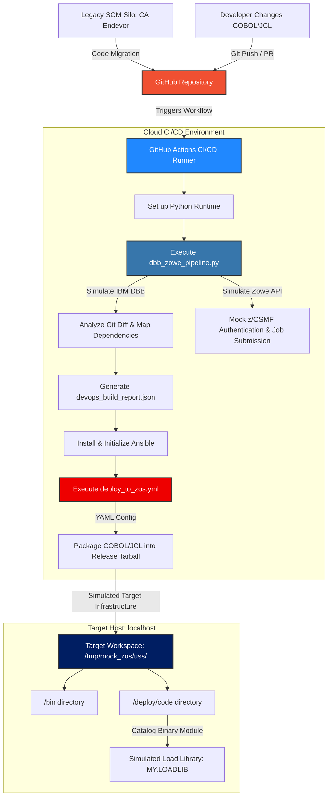

# Z-Bridge: Automated Git-to-z/OS Mainframe CI/CD Pipeline

## 📌 Project Overview
**Z-Bridge** is a modern DevOps automation engine designed to bridge traditional IBM z/OS core applications with contemporary distributed Git environments. This project explicitly replicates modern enterprise "In-Place Mainframe DevOps Transformations" by translating legacy engineering processes into automated infrastructure-as-code.

It models the transition of source assets out of legacy SCM platforms (like CA Endevor) into Git, using **Python** to mimic **IBM Dependency Based Build (DBB)** intelligence, and **Ansible** to orchestrate application package delivery into z/OS Unix System Services (USS) structures.

---

## 🛠️ Core Technology Stack
*   **Legacy Domain Architecture:** COBOL, JCL, CICS mapping concept, DB2 target schema logic.
*   **Source Code Management (SCM):** Git & GitHub (Migrated framework concept).
*   **Pipeline Automation Scripting:** Python (DBB logic & Zowe CLI orchestration simulation).
*   **Configuration & Deployment:** Ansible & YAML (Emulating IBM Wazi Deploy / UrbanCode Deploy).
*   **CI/CD Orchestration:** GitHub Actions.
*   **Container Portability:** Docker (Kubernetes and Red Hat OpenShift readiness).

---

## 🏗️ Architecture Workflow

Every code change pushed to the main repository passes through a structured automated lifecycle:



---

## 📂 Project Structure
```text
├── .github/workflows/
│   └── main-pipeline.yml     # CI/CD pipeline automation
├── cobol/
│   └── CUSTPROC.cbl          # Core business logic application 
├── jcl/
│   └── RUNPROC.jcl           # Legacy job execution script
├── dbb_zowe_pipeline.py      # Python integration & DBB engine
├── deploy_to_zos.yml         # Ansible deployment playbook
├── hosts.ini                 # Environment infrastructure targets
├── Dockerfile                # Cloud-native container packaging configuration
├── .gitignore                # Repository filter rules
└── README.md                 # Project documentation
```

---

## 🚀 How to Run Locally

### Execution via Docker (Recommended)
To run the entire pipeline inside an isolated, cloud-native container layout:
1. Build the Docker Image:
   ```bash
   docker build -t z-bridge-engine .
   ```
2. Run the Containerized Pipeline Sequence:
   ```bash
   docker run --rm z-bridge-engine
   ```

### Execution Native Local
1. Clone this repository:
   ```bash
   git clone https://github.com
   cd z-bridge-mainframe-devops
   ```
2. Run the Mainframe DBB and Zowe API Simulation engine:
   ```bash
   python dbb_zowe_pipeline.py
   ```
3. Execute the Ansible deployment playbook targeting the simulated z/OS environment:
   ```bash
   ansible-playbook -i hosts.ini deploy_to_zos.yml
   ```

---

## 🎯 Interview Talking Points (Key Value Add)
*   **Git-to-Mainframe Integration:** Demonstrates real-world fluency in migrating mainframe application workflows off CA Endevor/Changeman over to standard Git branching layouts.
*   **Modernizing with Python:** Shows the ability to replace old REXX or manual TSO routines with elegant, cross-platform Python scripts to scan metadata.
*   **Infrastructure-as-Code:** Proves ability to author complex multi-step Ansible playbooks targeting system automation setups.
*   **Cloud-Native Portability:** Demonstrates how packaging configuration automation tools inside a Docker container makes the pipeline plug-and-play ready for enterprise orchestration platforms like Kubernetes or Red Hat OpenShift on IBM Z.

